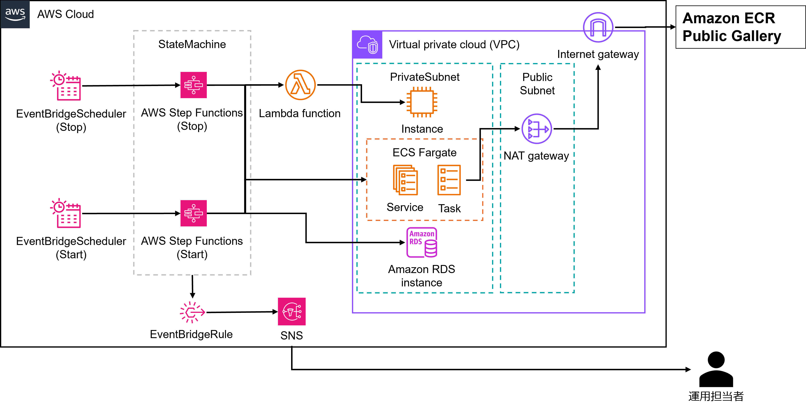

# AWS インスタンス自動起動/停止ソリューション
AWS リソースの自動停止・自動起動用の CloudFormation テンプレートです。

## 概要
このテンプレートは、AWS リソース (EC2、RDS、ECS) を自動的に停止・開始するためコスト削減の仕組みと EC2 における Insufficient Capacity Error 発生時の自動対応機能を提供します。  
一般的な Insufficient Capacity Error 発生時の対応はについては[こちら](https://repost.aws/ja/knowledge-center/ec2-insufficient-capacity-errors)をご参照ください。  
また、本テンプレートは主にガバメントクラウド利用者に向けたテンプレートとなっているため東京リージョン (ap-northeast-1) での利用が前提になっています。

## 機能

### 自動スケジューリング
- **インスタンス自動停止**: 指定時刻にリソースを停止
- **インスタンス自動開始**: 指定時刻にリソースを開始

### Insufficient Capacity Error発生時の自動対応
- **容量不足対応**: EC2 起動失敗時の代替インスタンスタイプ自動切り替え
- **インスタンスタイプの自動修正**: Insufficient Capacity Error により代替インスタンスで EC2 を起動した場合、AlternativeInstanceType の先頭に元のインスタンスタイプを指定することで次回の起動以降自動的に元のインスタンスタイプでの起動することが可能

### 自動起動、停止完了時の通知機能
- **通知機能**: 実行結果をメール通知

## 自動停止、起動の対象リソース
本テンプレートでは以下のリソースを対象に自動起動、停止を行うことが出来ます。  
既存リソースを対象に含める場合は、**デプロイ方法 2. リソースにタグ付け**に従い設定してください。
- **EC2インスタンス**: `AutoStopTarget=true`タグ付きインスタンス
- **RDSインスタンス**: `AutoStopTarget=true`タグ付きデータベース
- **ECSサービス**: `AutoStopTarget=true`タグ付きサービス  

また、デプロイ時に**FlgDemo**パラメタを true にすることで本テンプレートの検証用 EC2 及び ECS タスクのデプロイが可能です。  

## アーキテクチャ



## デプロイ方法
本テンプレートはマネジメントコンソールからのデプロイが前提になります。

### 1. CloudFormationでデプロイ

| 領域 | 起動ボタン |
|------|------------|
| ap-northeast-1 (東京) | [](https://console.aws.amazon.com/cloudformation/home?region=ap-northeast-1#/stacks/new?stackName=sample-costsavings-solution) |


パラメータを変更する場合は下記の表を参考にしてください。  
| パラメータ | 説明 | デフォルト値 | 変更の必要性 | 変更内容 |
|-----------|------|-------------|-------------|----------|
| `AutoStopScheduling` | 停止スケジュール (cron式) | `cron(0 12 * * ? *)` | Required | 実際の運用で停止する時間帯に修正 |
| `AutoStartScheduling` | 開始スケジュール (cron式) | `cron(5 12 * * ? *)` | Required | 実際の運用で開始する時間帯に修正 |
| `AutoStopTarget` | 対象識別タグ | `true` | No | 対象のリソースを識別するためのタグなので基本的に変更不要 |
| `EmailAddress` | 通知先メールアドレス | - | Required | 実際の運用で利用しているアドレスを指定 |
| `FlgDemo` | デモリソース作成フラグ | `true` | Optional | 検証用リソースが不要な場合はfalseに設定 |
| `NamePrefix` | リソース名プレフィックス | `autostop` | Optional | リソース名を変更する場合は変更可能 |

**AutoStopInstanceTemplate.yaml**をマネジメントコンソールからデプロイする際の詳細な手順は[User Guide](https://docs.aws.amazon.com/AWSCloudFormation/latest/UserGuide/cfn-console-create-stack.html)をご確認ください。  
デプロイが完了するまでお待ちください。(約 5 分程度かかる場合があります)     

### 2. (Option) 既存リソースへのタグ付け

自動停止・開始の対象にしたい既存リソースがある場合は以下のタグを追加してください。  

```
Key: AutoStopTarget
Value: true
```

### 3. (Option) Insufficient Capacity Error発生時に代替インスタンスでの起動を試す場合

Insufficient Capacity Error 発生時に代替インスタスタイプで起動する場合はリソースに以下のタグを追加を追加してください。  
※Value は適宜適切なインスタンスタイプの候補に置き換えてください。  
```
Key: AlternativeInstanceType
Value: t3.small,t3.medium,t4g.small
```

## リソースの削除方法
### 1. スタックの削除
マネジメントコンソールから作成したスタックを指定して削除してください。
スタックの削除方法の詳細は [User Guide](https://docs.aws.amazon.com/AWSCloudFormation/latest/UserGuide/cfn-console-delete-stack.html) を参考にしてください。  


### 2. 既存リソースのタグ付け解除
既存リソースに対して**デプロイ方法 - 2. リソースにタグ付け**あるいは**デプロイ方法 - 3. (Option) Insufficient Capacity Error発生時に代替インスタンスでの起動を試す場合**の作業を行っている場合は、対象のリソースから**AutoStopTarget**, **AlternativeInstanceType**タグを削除してください。   


## 料金
本テンプレートをご利用いただく際の、料金試算例を公開しております。(従量課金制となっており、実際の料金はご利用内容により変動いたします。)   

### 基本料金 (常時発生)     

| サービス | リソース | 料金 (東京リージョン)    | 補足 |
|---------|---------|---------------------|---------|
| **Lambda** | 3関数 × 128 MB × 10分/月 | 約 $0.00/月 | 無料利用枠内 | 
| **Step Functions** | Standard 2ワークフロー × 2回/日 | 約 $0.00/月 | 無料利用枠内。Standardワークフローは状態遷移の数に基づいて料金は計算されます。 |
| **EventBridge** | Scheduler 2ルール + Rule 1個 | 約 $0.00/月 | 自動起動、停止用のステートマシンを1日1回ずつ呼び出す場合、無料利用枠内 |
| **SNS** | トピック1個 + メール通知60回/月 | 約 $0.00/月 | 1,000件までの通知は無料利用枠内 | 
| **Resource Groups** | 1グループ | $0.00/月 | - |
| **CloudWatch Logs** | 1 GB/月 | 約 $0.76/月 | 月5 GBまでであれば無料利用枠内 |

**基本料金合計: 約 $0.76/月**

### 検証リソース料金 (FlgDemo=true時)   

| サービス | リソース | 料金 (停止時/稼働時)    | 補足 |
|---------|---------|---------------------|---------|
| **EC2** | t2.micro × 1台 | 約 $11.10/月 (稼働時)    | OnDemand
| **ECS** | Fargate 0.25vCPU, 0.5 GB | 約 $11.09/月 (稼働時)    | OnDemand
| **NAT Gateway** | NAT Gateway + Elastic IP | 約 $45.88/月 | 1GW、データ転送量10 GB per month
| **KMS** | CloudWatch Logs KMS Key | 約 $1.00/月 | 


**検証リソース合計: 約 $69.07/月**

### 注意事項

- 各環境での利用においては十分にテストの上ご使用ください。  
特に RDS は一時的に停止後、再度起動する際に Insufficient Capacity Error が発生するとスナップショットから復元する必要が生じる可能性があるので、本番等クリティカルな環境でのご使用には十分ご注意ください。
- 料金は 2025 年 10 月時点の東京リージョン価格
- 実際の料金は使用量により変動
- 詳細な料金計算は[AWS料金計算ツール](https://calculator.aws)をご利用ください